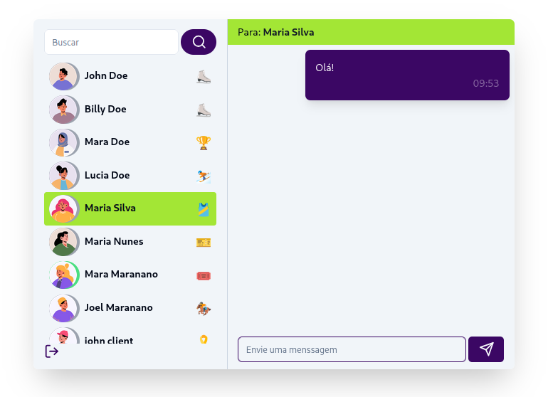

# ZapChat

## Descrição

O **ZapChat** é um app de chat em tempo real que permite a comunicação entre usuários em tempo real, com um sistema de autenticação criptografia, além de fornecer uma interface intuitiva, simples e moderna.

## Tecnologias Utilizadas

- **Frontend**: React, TailwindCSS, Shadcn
- **Backend**: Node.js, Express
- **Banco de Dados**: MongoDB
- **WebSockets**: Socket.io para comunicação em tempo real
- **Autenticação**: JWT (JSON Web Token)

### Pré-requisitos

- Node.js 
- MongoDB configurado e em execução

### Uso

-Clone o repositório
-Installe todas dependências necessárias
-No terminal, digite "npm run build"
-Após a instalação, digite "npm start" 

### Referências e base para o desenvolvimento

-Youtube: canais "As a programmer" e "Kishan Sheth"
